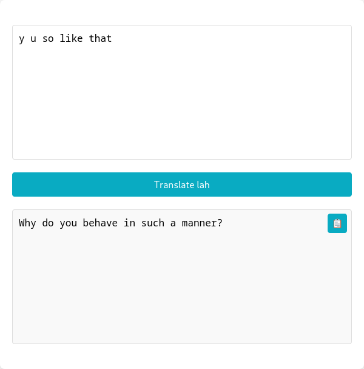

# LAH - Tranlate Manglish to English

A single-page web application for Kakitangan.com users to translate Manglish to Oxford English.



## Setup

1. Install dependencies:
```bash
npm install -g yarn
yarn install
```

2. Start development server:
```bash
yarn run dev
```

3. Build for production:
```bash
yarn run build
```

4. Deploy to S3:
```bash
aws s3 sync dist/ s3://your-bucket-name --delete
```

## But why?

> Are you look down at my English? You think you so good ah?

Erm, listen, there are all sorts of people...

Never mind, forget it. Go back to TikTok, pretend this never existed.

> There's something about Manglish...

Have a read at ['lah' as the last word](https://ykgoon.com/lah-as-the-last-word.html).
